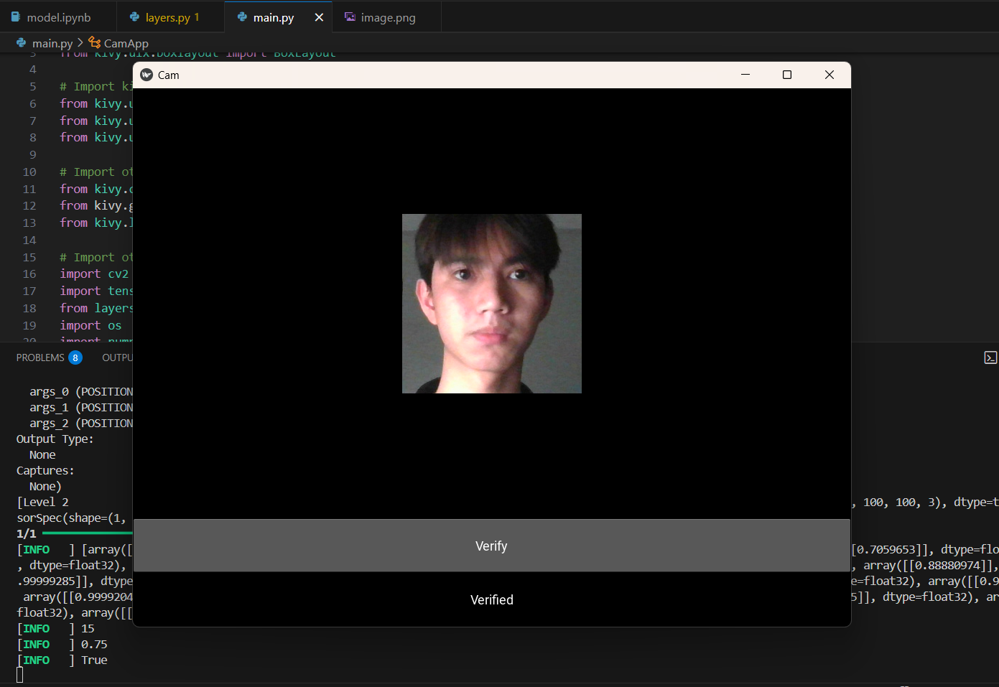
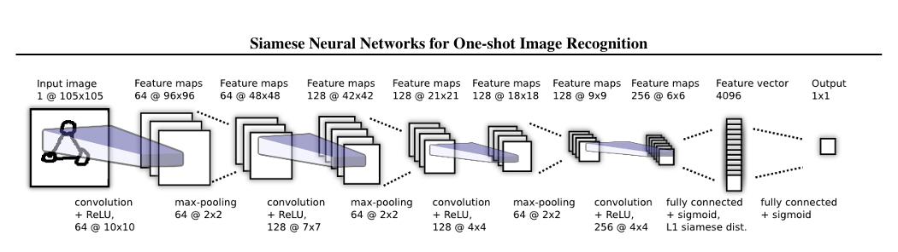

# Face Recognition with Siamese Network

## 📝 Overview
A real-time face recognition system that leverages Siamese Neural Networks and Kivy GUI framework. The system performs live face verification through webcam input, comparing captured faces against known samples.



## 🏗️ Architecture
This project implements a Siamese Neural Network for face verification:



## 🛠️ Technologies
- Python 
- TensorFlow 
- OpenCV
- Kivy Framework
- NumPy

## 📁 Project Structure
```
FaceRecognition/
├── main.py            # Main application with GUI
├── layers.py          # Custom L1 distance layer
├── model.ipynb        # Model training notebook
├── siamesemodel.h5    # Trained Siamese model
├── requirements.txt   # Project dependencies
├── application_data/  # Data directory
│   └── input_image/   # Verification images
└── README.md         # Documentation
```


